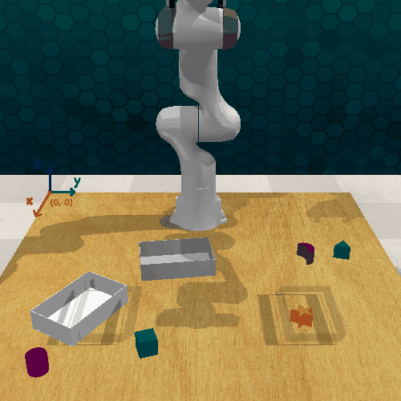
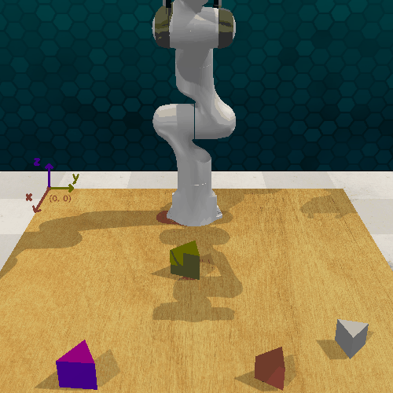

# EmbodiedBench_Qwen2.5-VL-72B
具身智能benchmark：EmbodiedBench的复现以及在Qwen2.5-VL-72B上的测评

项目原地址:

https://github.com/EmbodiedBench/EmbodiedBench.git

## 🎉复现效果展示
本仓库实现了EmbodiedBench在EB-Manipulation环境中Qwen2.5-VL-72B的测评，以base任务为例:

<div align="center">
  <div style="display: flex; flex-wrap: wrap; justify-content: center; gap: 30px;">
    <figure style="margin: 0; text-align: center; max-width: 320px;">
      
      <figcaption style="margin-top: 12px; font-size: 0.95em; color: #c7254e;">
        ❌ 失败案例：Pick up the star and place it into the silver container
      </figcaption>
    </figure>
    <figure style="margin: 0; text-align: center; max-width: 320px;">
      
      <figcaption style="margin-top: 12px; font-size: 0.95em; color: #3c763d;">
        ✅ 成功案例：Stack the maroon triangular prism and the olive triangular prism in sequence.
      </figcaption>
    </figure>
  </div>
</div>

## 💡本仓库的主要贡献
(1)解决了一些在非Docker环境中，基于Qwen2.5-VL-72B在EB-Manipulation复现的环境冲突，修复了pyairports库不存在的问题

(2)加入了自动生成gif的功能，在每一轮训练结束以后，生成该轮训练的gif动图

(3)提供了复现EmbodiedBench的中文参考

## 💻安装
下载仓库
```bash
git clone https://github.com/Kawai0724/EmbodiedBench_Qwen2.5-VL-72B.git
cd EmbodiedBench
```

### 创建EB-Manipulation的环境
```bash
conda env create -f conda_envs/environment_eb-man.yaml 
conda activate embench_man
pip install -r requirements_eb-man.txt
pip install -e .
```

注意：EB-Alfred、EB-Habitat 和 EB-Manipulation 需要从 Hugging Face 或 GitHub 仓库下载大型数据集。请运行以下命令以确保 Git LFS 已正确初始化：
```bash
git lfs install
git lfs pull
```

### 启动无头服务器

在无头服务器上运行实验前，请先运行startx.py脚本。该脚本应在另一个tmux窗口中启动。我们默认使用X_DISPLAY id=1。

```bash
python -m embodiedbench.envs.eb_alfred.scripts.startx 1
```

### 安装 CoppeliaSim 仿真器

CoppeliaSim（原 V-REP）是一款机器人仿真软件，EB-Manipulation 依赖它进行环境交互。

注意: CoppeliaSim V4.1.0 required for Ubuntu 20.04; you can find other versions here (https://www.coppeliarobotics.com/previousVersions#)

```bash
conda activate embench_man
cd embodiedbench/envs/eb_manipulation
wget https://downloads.coppeliarobotics.com/V4_1_0/CoppeliaSim_Pro_V4_1_0_Ubuntu20_04.tar.xz
tar -xf CoppeliaSim_Pro_V4_1_0_Ubuntu20_04.tar.xz
rm CoppeliaSim_Pro_V4_1_0_Ubuntu20_04.tar.xz
mv CoppeliaSim_Pro_V4_1_0_Ubuntu20_04/ /PATH/YOU/WANT/TO/PLACE/COPPELIASIM
```

配置环境变量，让系统能找到 CoppeliaSim 及其依赖库：

```bash
echo "export COPPELIASIM_ROOT=/PATH/YOU/WANT/TO/PLACE/COPPELIASIM" >> ~/.bashrc
echo "export LD_LIBRARY_PATH=\$LD_LIBRARY_PATH:\$COPPELIASIM_ROOT" >> ~/.bashrc
echo "export QT_QPA_PLATFORM_PLUGIN_PATH=\$COPPELIASIM_ROOT" >> ~/.bashrc
source ~/.bashrc   
```

 ### 安装 PyRep 与 EB-Manipulation 包：
 
 PyRep 是 CoppeliaSim 的 Python 绑定库，提供从 Python 控制仿真环境的接口。EB-Manipulation 是基于 PyRep 构建的基准测试套件。

 注意，请保持当前目录是embodiedbench/envs/eb_manipulation

 ```bash
 git clone https://github.com/stepjam/PyRep.git
cd PyRep
pip install -r requirements.txt
pip install -e .
cd ..
```

### 安装 EB-Manipulation 包本身：
```bash
pip install -r requirements.txt
pip install -e .
cp ./simAddOnScript_PyRep.lua $COPPELIASIM_ROOT
```

### 下载数据集:

EB-Manipulation 包含预先录制的演示数据，用于训练或评估。

```bash
git clone https://huggingface.co/datasets/EmbodiedBench/EB-Manipulation
mv EB-Manipulation/data/ ./
rm -rf EB-Manipulation/
cd ../../..
```

## 💡测试

运行以下代码测试EB-Manipulation是否被正确安装:(注意提前启动Headless Server)

```bash
conda activate embench_man
export DISPLAY=:1
python -m embodiedbench.envs.eb_manipulation.EBManEnv
```

## 🚀评估

```bash
export DISPLAY=:1
python -m embodiedbench.main \
    env=eb-man \
    model_name=Qwen/Qwen2.5-VL-72B-Instruct \
    model_type=local \
    tp=4 \ #根据gpu数量调整
    exp_name='qwen72b_baseline'
```
运行结果可以./embodiedbench/running中查看，本仓库添加了gif查看功能


## Citation

```
@inproceedings{
yang2025embodiedbench,
title={EmbodiedBench: Comprehensive Benchmarking Multi-modal Large Language Models for Vision-Driven Embodied Agents},
author={Rui Yang and Hanyang Chen and Junyu Zhang and Mark Zhao and Cheng Qian and Kangrui Wang and Qineng Wang and Teja Venkat Koripella and Marziyeh Movahedi and Manling Li and Heng Ji and Huan Zhang and Tong Zhang},
booktitle={Forty-second International Conference on Machine Learning},
year={2025},
url={https://openreview.net/forum?id=DgGF2LEBPS}
}
```